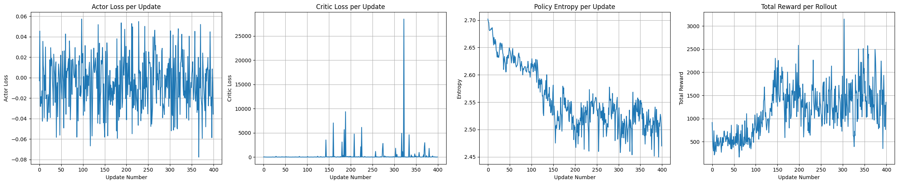
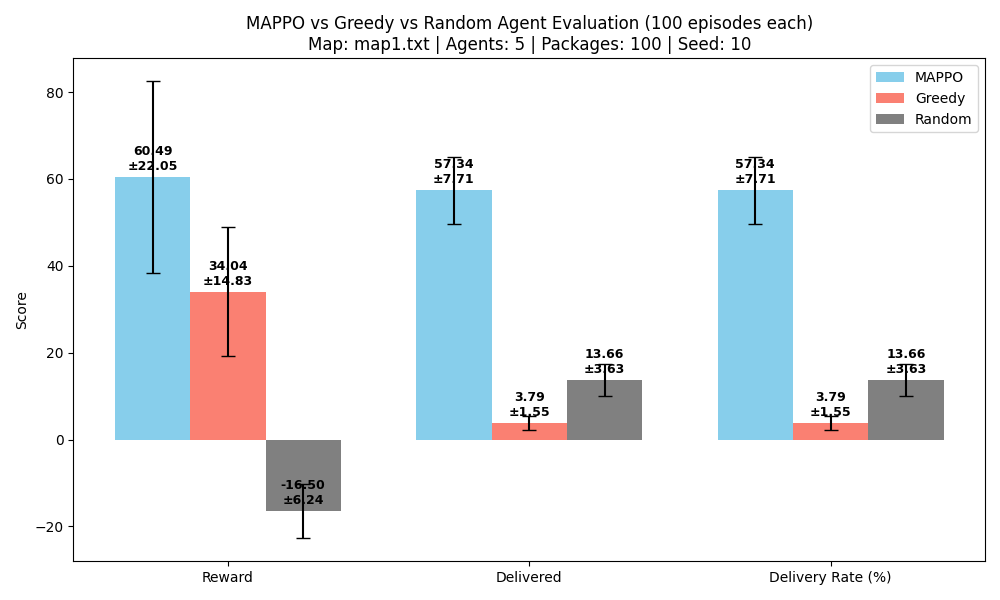
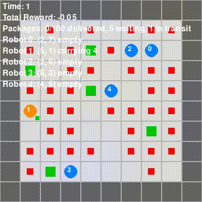

# MARL-Delivery: Multi-Agent Reinforcement Learning for Package Delivery

This project implements a multi-agent system for efficient package delivery in a dynamic grid world. Robots learn to coordinate, navigate obstacles, and deliver packages before deadlines using **Multi-Agent Proximal Policy Optimization (MAPPO)**.

---

## Overview

*   **Problem:** Multiple robots in an $(N \times N)$ grid with obstacles must pick up dynamically spawning packages and deliver them to target locations within deadlines, maximizing collective reward.
*   **Solution:** MAPPO with decentralized actors (local observations) and a centralized critic (global state).
*   **Key Features:**
    *   Multi-channel spatial and vector features for comprehensive state representation.
    *   Detailed reward shaping to guide learning towards efficient and timely deliveries.
    *   Robust PPO-based training pipeline.

---

## Table of Contents

1.  [Problem Details](#problem-details)
2.  [Solution Approach](#solution-approach)
    *   [State Representation](#state-representation)
    *   [Action Space & Rewards](#action-space--rewards)
    *   [Network Architecture](#network-architecture)
3.  [Results](#results)
    *   [Training Performance](#training-performance)
    *   [Comparative Evaluation](#comparative-evaluation)
    *   [Qualitative Demonstration](#qualitative-demonstration)
4.  [Setup & Usage](#setup--usage)
5.  [Hyperparameters](#hyperparameters)

---

## Problem Details

*   **Environment:** `C` robots navigate an `N x N` grid. Cells can be empty or obstacles.
*   **Packages:** Spawn with start/target locations and deadlines. Robots carry one package at a time.
*   **Objective:** Maximize total team reward over `T` timesteps.
*   **Rules:** Robots avoid obstacles/map edges. Priority rules for shared cells and package pickups.
*   **Core Rewards:**
    *   On-time delivery: **+10**
    *   Late delivery: **+1**
    *   Movement (L, R, U, D): **-0.01** per move

**Map Examples:**
| Map 1                               | Map 2                               | Map 3                               | Map 4                               | Map 5                               |
| :----------------------------------: | :----------------------------------: | :----------------------------------: | :----------------------------------: | :----------------------------------: |
|              |              |              |              |              |

---

## Solution Approach

We use **Multi-Agent Proximal Policy Optimization (MAPPO)**.

### State Representation

Each agent (robot) uses local observations, while the shared critic uses a global state. Both use a combination of:
*   **Spatial Features (Multi-channel 2D map):** Processed by a CNN. Includes obstacle locations, robot positions, package start/target locations.
    *   *Actor (Local - 6 channels):* Obstacle map, current robot position, other robots' positions, 'waiting' package start positions, 'active' package target positions, current robot's carried package target position. (Visualized in `demo/obs.png`)
    *   *Critic (Global - 4 channels):* Obstacle map, all robot positions, 'waiting' package start positions, 'active' package target positions. (Visualized in `demo/state.png`)
*   **Vector Features (1D vector):** Processed by an MLP. Includes normalized positions, carrying status, package deadlines, relative information about other entities, and global timestep.
    *   *Actor (Local):* Features for self, nearby other robots, and nearby packages. (Visualized in `demo/obs_vector.png`)
    *   *Critic (Global):* Features for all robots and all active packages. (Visualized in `demo/state_vector.png`)

*(See the code, Jupyter notebooks, and `demo` folder for specific channel breakdowns and feature visualizations.)*

### Action Space & Rewards

*   **Actions (15 per robot, decomposed into 5 movements x 3 package operations):**
    *   Movements: Stay, Left, Right, Up, Down.
    *   Package Ops: Do Nothing, Pick Up, Drop.
*   **Reward Shaping:** To guide learning, we add shaped rewards for:
    *   Successful pickup bonus: `+5`
    *   Successful on-time delivery bonus: `+200`
    *   Successful late delivery bonus: `+20`
    *   Moving closer to task-relevant targets (e.g., package to pick up, or destination for carried package): `+0.02`
    *   Penalties for collisions or unproductive idle behavior: `-0.05`
    *   Penalty for moving away from task-relevant targets: `-0.01`

### Network Architecture

*   **Actor & Critic:** Both use a CNN for spatial features and an MLP for vector features. Their outputs are concatenated and processed by a final MLP.
    *   The Actor outputs action logits for the 15 discrete actions.
    *   The Critic outputs a single state-value.
    *   Adaptive Average Pooling is used after CNN layers to handle potentially varying map sizes (within reason) and provide a fixed-size input to the final MLPs.

---

## Results

The MAPPO agents demonstrate significantly improved coordination and efficiency compared to baselines, learning complex policies for navigation, package pickup, and delivery.

### Training Performance

Agents were trained for **1,000,000 total timesteps** across 5 parallel environments (map1.txt, 5 agents, 50 packages). The training progress shows a clear learning trend:

*   **Total Reward per Rollout:** Initially fluctuating, the average reward per 500-step rollout steadily increased, starting from an average of ~500 in early rollouts and consistently exceeding ~1500-2000 in later stages, with peaks over 2500.
*   **Policy Entropy:** Gradually decreased, indicating the policy became more deterministic and confident as training progressed.
*   **Actor & Critic Losses:** Showed convergence, though with some expected noise, indicating stable learning.

**Training Progress Plots:**
*(These plots reflect the training run documented in the provided notebook output)*


*(Caption: From left to right: Actor Loss per Update, Critic Loss per Update, Policy Entropy per Update, Total Reward per Rollout. Each update corresponds to data from 2500 environment steps (500 rollout_steps * 5 num_envs).)*

### Comparative Evaluation

To assess the final performance, the trained MAPPO agent was evaluated against a **Greedy heuristic baseline** and a **Random action baseline**. The evaluation was conducted on `map1.txt` with 5 agents and 100 packages, averaged over 100 episodes (Seed: 10).

*   **Greedy Agent:** Robots move to the nearest available package, then to its destination. Simple collision avoidance.
*   **Random Agent:** Robots pick actions randomly from the available action space.

**Evaluation Metrics:**

| Metric             | MAPPO (Mean ± Std) | Greedy (Mean ± Std) | Random (Mean ± Std) |
| :----------------- | :------------------: | :-----------------: | :-----------------: |
| **Reward**         | **60.49 ± 22.05**    |   34.04 ± 14.83   |  -16.50 ± 6.24    |
| **Delivered (count)**| **57.34 ± 7.71**     |    3.79 ± 1.55    |   13.66 ± 3.63    |
| **Delivery Rate (%)**| **57.34 ± 7.71**     |    3.79 ± 1.55    |   13.66 ± 3.63    |

*(Note: "Delivered" is the average count of packages successfully delivered per episode. "Delivery Rate (%)" is this count as a percentage of total packages spawned in those episodes, e.g., if 100 packages per episode, delivery rate = delivered/100 × 100%. For evaluation, results are averaged over multiple episodes with different random seeds to reflect performance diversity; error bars (±std) indicate standard deviation across episodes.)*

**Comparative Performance Chart:**


*(Caption: Performance comparison on Reward, Delivered Packages, and Delivery Rate (%) for MAPPO, Greedy, and Random agents on map1.txt, 5 agents, 100 packages, averaged over 100 episodes.)*

**Key Observations:**

*   **MAPPO Superiority:** The MAPPO agent significantly outperforms both Greedy and Random baselines in terms of total reward and delivery rate.
*   **Effective Coordination:** The high delivery rate of MAPPO agents indicates learned cooperative strategies and efficient task allocation.
*   **Greedy Agent Limitations:** The Greedy agent performs poorly, delivering very few packages. This suggests that simple heuristics are insufficient for this complex, dynamic multi-agent task.
*   **Random Agent Surprise:** Interestingly, the Random agent delivers more packages than the Greedy agent on this specific setup. This might be due to the Greedy agent getting stuck in repetitive, suboptimal behaviors, while the Random agent's stochasticity allows it to occasionally stumble upon successful deliveries. However, the Random agent still achieves a highly negative average reward due to inefficient movement and lack of coordination.

### Qualitative Demonstration

Visual inspection of agent behavior further highlights the learned capabilities.

**Legend:**
Obstacles (Gray Blocks) | Robot Empty (Blue Circle) | Robot Carrying (Orange Circle + Small Green Square)
Package Target (Red Square) | Delivered Target (Gray Square) | Waiting Package (Green Square)

| Agent Type | Simulation | Description |
|---|---|---|
| Greedy Agent (Baseline) | [](demo/greedy_simulation.gif) | Robots use a simple heuristic, often leading to inefficient paths and congestion. Click the image to view the simulation. |
| MAPPO Agent (Our Solution) | [](demo/mappo_simulation.gif) | Robots exhibit coordinated movement, proactive package acquisition, and efficient delivery routes. Click the image to view the simulation. |
| Random Agent (Baseline) | [](demo/random_simulation.gif) | Robots act randomly, resulting in highly inefficient and uncoordinated behavior. Click the image to view the simulation. |

---

## Setup & Usage

### Prerequisites
*   Python 3.7+
*   PyTorch (e.g., 1.9+ with CUDA if available)
*   NumPy, Matplotlib
*   `scikit-learn` (for `LabelEncoder` in action conversion if running the training script directly)

### Installation & Running
1.  **Clone:**
    ```bash
    git clone https://github.com/nguyenduchuyiu/marl-delivery.git
    cd marl-delivery
    ```
2.  **Training:**
    *   The primary training script is `MAPPO/marl-delivery-mappo.ipynb`.
    *   Configure hyperparameters within the notebook.
    *   Run the notebook cells. Models are saved periodically to the `MAPPO/models/` directory (e.g., `MAPPO/models/mappo_update100_actor.pt`, `MAPPO/models/mappo_final_actor.pt`).
3.  **Evaluation / Testing:**

    To evaluate the trained MAPPO agent and compare its performance against Greedy and Random agents, run the `evaluation.py` script with the desired parameters.  Here's an example command:

    ```bash
    python evaluation.py --seed 10 --max_time_steps 1000 --map map1.txt --num_agents 5 --n_packages 100 --num_test_episodes 100
    ```

    **Arguments:**

    *   `--seed`:  The random seed for environment generation and agent initialization.  Using the same seed ensures consistent environments across evaluation runs.
    *   `--max_time_steps`: The maximum number of time steps allowed per episode.
    *   `--map`: The name of the map file to use (e.g., `map1.txt`).
    *   `--num_agents`: The number of agents (robots) in the environment.
    *   `--n_packages`: The number of packages that will spawn during each episode.
    *   `--num_test_episodes`: The number of episodes to run for each agent type (MAPPO, Greedy, Random) to collect performance statistics.
    *   `--mappo_model_path`: (Optional) Path to the trained MAPPO actor model. Defaults to `MAPPO/models/mappo_final_actor.pt`.
    *   `--device`: (Optional) Device to run the MAPPO model on (e.g., `cpu`, `cuda`). Defaults to `cpu`.

    The script will output the mean and standard deviation of reward, number of delivered packages, and delivery rate for each agent type.  It will also generate a plot comparing the performance of the agents.

---

## Hyperparameters

Key training parameters used for the documented results (refer to `marl-delivery-mappo.ipynb` for a full list):
*   **Environment:**
    *   `MAP_FILE = "marl_delivery/map1.txt"`
    *   `NUM_AGENTS = 5`
    *   `N_PACKAGES = 50` (per episode during training)
    *   `MAX_TIME_STEPS_PER_EPISODE = 500`
*   **Training:**
    *   `TOTAL_TIMESTEPS = 1,000,000`
    *   `NUM_ENVS = 5` (parallel environments)
    *   `ROLLOUT_STEPS = 500` (steps per environment before update)
*   **PPO Algorithm:**
    *   `LR_ACTOR = 1e-5`
    *   `LR_CRITIC = 1e-5`
    *   `GAMMA = 0.99` (Discount factor)
    *   `GAE_LAMBDA = 0.95` (GAE parameter)
    *   `CLIP_EPS = 0.2` (PPO clip ratio)
    *   `NUM_EPOCHS = 5` (Epochs to train on collected data per update)
    *   `MINIBATCH_SIZE = 64` (per agent, effectively `64 * NUM_AGENTS` for actor updates across all agents' data from a minibatch of transitions)
    *   `ENTROPY_COEF = 0.01`
    *   `VALUE_LOSS_COEF = 0.5`
*   **Network Architecture:**
    *   `CNN_CHANNELS_OUT = 64`
    *   `MLP_HIDDEN_DIM = 256`
    *   `COMBINED_HIDDEN_DIM = 256`

---

*For more detailed information on the implementation, state representation channels, specific reward shaping logic, and network architectures, please refer to the source code and accompanying Jupyter notebooks.*