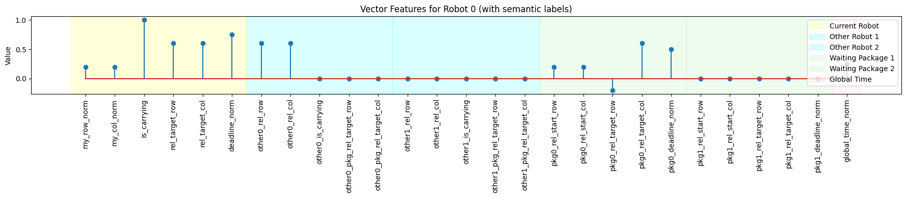

# MARL-Delivery: Multi-Agent Reinforcement Learning for Package Delivery

This project implements a multi-agent system for efficient package delivery in a dynamic grid world. Robots learn to coordinate, navigate obstacles, and deliver packages before deadlines using **Multi-Agent Proximal Policy Optimization (MAPPO)**.

---

## Overview

*   **Problem:** Multiple robots in an $(N \times N)$ grid with obstacles must pick up dynamically spawning packages and deliver them to target locations within deadlines, maximizing collective reward.
*   **Solution:** MAPPO with decentralized actors (local observations) and a centralized critic (global state).
*   **Key Features:**
    *   Multi-channel spatial and vector features for comprehensive state representation.
    *   Detailed reward shaping to guide learning towards efficient and timely deliveries.
    *   Robust PPO-based training pipeline.

---

## Demo: MAPPO vs. Greedy Agent

**Legend:**
Obstacles (Gray Blocks) | Robot Empty (Blue Circle) | Robot Carrying (Orange Circle + Small Green Square)
Package Target (Red Square) | Delivered Target (Gray Square) | Waiting Package (Green Square)

| Greedy Agent (Baseline)                                     | MAPPO Agent (Our Solution)                                      |
| :----------------------------------------------------------: | :-------------------------------------------------------------: |
| [](demo/greedy_simulation.mp4) | [](demo/mappo_simulation.mp4) |
| *Robots use a simple heuristic.*                             | *Robots learn a coordinated policy.*                            |

---

## Table of Contents

1.  [Problem Details](#problem-details)
2.  [Solution Approach](#solution-approach)
    *   [State Representation](#state-representation)
    *   [Action Space & Rewards](#action-space--rewards)
    *   [Network Architecture](#network-architecture)
3.  [Results](#results)
4.  [Setup & Usage](#setup--usage)
5.  [Hyperparameters](#hyperparameters)

---

## Problem Details

*   **Environment:** `C` robots navigate an `N x N` grid. Cells can be empty or obstacles.
*   **Packages:** Spawn with start/target locations and deadlines. Robots carry one package at a time.
*   **Objective:** Maximize total team reward over `T` timesteps.
*   **Rules:** Robots avoid obstacles/map edges. Priority rules for shared cells and package pickups.
*   **Core Rewards:**
    *   On-time delivery: **+10**
    *   Late delivery: **+1**
    *   Movement (L, R, U, D): **-0.01** per move

**Map Examples:**
| Map 1                               | Map 2                               | Map 3                               | Map 4                               | Map 5                               |
| :----------------------------------: | :----------------------------------: | :----------------------------------: | :----------------------------------: | :----------------------------------: |
|              |              |              |              |              |

---

## Solution Approach

We use **Multi-Agent Proximal Policy Optimization (MAPPO)**.

### State Representation

Each agent (robot) uses local observations, while the shared critic uses a global state. Both use a combination of:
*   **Spatial Features (Multi-channel 2D map):** Processed by a CNN. Includes obstacle locations, robot positions, package start/target locations.
    *   *Actor (Local):* 
    *   *Critic (Global):* 
*   **Vector Features (1D vector):** Processed by an MLP. Includes normalized positions, carrying status, package deadlines, and relative information about other entities.
    *   *Actor (Local):* 
    *   *Critic (Global):* 

*(See the code and detailed documentation for specific channel breakdowns.)*

### Action Space & Rewards

*   **Actions (15 per robot):**
    *   Movements: Stay, Left, Right, Up, Down.
    *   Package Ops: Do Nothing, Pick Up, Drop.
*   **Reward Shaping:** To guide learning, we add shaped rewards for:
    *   Successful pickup (`+5`).
    *   Successful on-time/late delivery (significantly higher than base rewards: `+200`/`+20`).
    *   Moving closer to/away from task-relevant targets.
    *   Penalties for collisions or unproductive idle behavior.

### Network Architecture

*   **Actor & Critic:** Both use a CNN for spatial features and an MLP for vector features. Their outputs are combined and processed by another MLP.
    *   The Actor outputs action logits.
    *   The Critic outputs a single state-value.

---

## Results

*   **Baseline (Greedy Agent):** Robots follow simple heuristics (e.g., move to the nearest package, then to its destination).
*   **MAPPO Agent:** After training for 1,000,000 timesteps, the MAPPO agents demonstrate significantly improved coordination and efficiency, leading to higher overall rewards compared to the greedy baseline. They learn to navigate, pick up, deliver, and adapt to new packages effectively.
    *   *(Example training progress: Average rollout reward across 5 environments increased substantially, often exceeding 1500-2000 per 500-step rollout in later stages.)*

---

## Setup & Usage

### Prerequisites
*   Python 3.7+
*   PyTorch (e.g., 1.9+ with CUDA if available)
*   NumPy, scikit-learn, Matplotlib

### Installation & Running
1.  **Clone:**
    ```bash
    git clone https://github.com/nguyenduchuyiu/marl-delivery.git
    cd marl-delivery
    ```
2.  **Training:**
    *   Configure hyperparameters in `marl-delivery-mappo.ipynb` or your main training script.
    *   Run the notebook/script. Models are saved periodically.
3.  **Evaluation / Testing Scripts:**
    (Example commands to run pre-trained models or test specific configurations)
    ```bash
    python main.py --seed 10 --max_time_steps 1000 --map map1.txt --num_agents 5 --n_packages 100
    # Add other map configuration commands as needed
    python main.py --seed 10 --max_time_steps 1000 --map map5.txt --num_agents 10 --n_packages 1000
    ```

---

## Hyperparameters

Key training parameters (refer to the code for a full list):
*   **Environment:** `NUM_AGENTS = 5`, `MAX_TIME_STEPS_PER_EPISODE = 500`, `N_PACKAGES = 50-1000` (varies by map).
*   **Training:** `TOTAL_TIMESTEPS = 1,000,000`, `NUM_ENVS = 5` (parallel), `ROLLOUT_STEPS = 500`.
*   **PPO:** `LR_ACTOR/CRITIC = 1e-5`, `GAMMA = 0.99`, `GAE_LAMBDA = 0.95`, `CLIP_EPS = 0.2`, `NUM_EPOCHS = 5`, `MINIBATCH_SIZE = 64`.

---

*For more detailed information on the implementation, state representation channels, and specific reward shaping logic, please refer to the source code and accompanying Jupyter notebooks.*